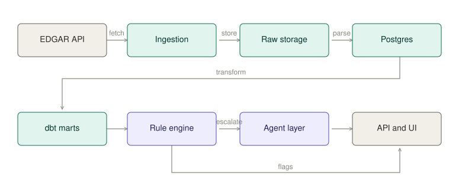

# Architecture

<!--toc:start-->
- [Architecture](#architecture)
  - [Principles](#principles)
  - [Pipeline](#pipeline)
  - [Layers](#layers)
<!--toc:end-->

Palimpsest reads SEC filings and reports what changed. Numbers come from structured data and deterministic code; a language model is used only to read prose, and everything it states carries a citation to the filing it came from.

## Principles

**Anything that must be correct is computed, not generated.** Financial figures, quarter-over-quarter comparisons, red-flag rules, and ranking are ordinary code over a warehouse. A language model cannot silently change a margin calculation.

**The model reads, it does not decide.** Risk factors, MD&A, and language diffs are unstructured prose. That is where a model earns its cost. Everything it produces must carry a citation to a specific passage in a specific filing.

**Deterministic findings reach the model as data.** Margins, growth rates and red-flag columns are computed in SQL and handed to the model alongside the raw figures. The model reports and explains them; it never recalculates them.

**Raw responses are never discarded.** EDGAR serves current state, not history. Every response is stored before parsing so a parser change can be replayed against the original bytes.

## Pipeline

Raw storage sits between ingestion and the database: responses are written to disk first, and Postgres is populated by parsing what was stored. A parser change is replayed from storage without refetching.

Everything to the left of the agent is deterministic. The agent reads what that layer produced, and is checked against it afterwards.

## Layers

**Ingestion.** A throttled EDGAR client fetches the ticker-to-CIK mapping, per-company filing indexes, and XBRL company facts. Every response is written to storage under a dated key before parsing. Reruns are idempotent: records are upserted on their natural key, and progress through the pipeline is tracked with a nullable timestamp per stage, so any stage can be resumed independently.

**Warehouse.** Postgres holds parsed filing metadata, XBRL facts, extracted filing sections, and chunk embeddings via pgvector. Raw documents stay in storage; only what is queried lives in the database.

**Transform.** dbt turns raw facts into metrics in five steps: staging types and classifies each fact's period as an instant, a quarter, or a year; a deduplication model reduces every re-reported figure to its most recently filed version; a seed maps XBRL tags to metric names by priority; fourth-quarter flows absent from the filings are derived from the annual figure and marked as derived; and the results are pivoted into a quarterly and a yearly table, one row per company per period. Report tables sit on top — one carrying ratios, growth rates and red-flag columns, one listing paragraph-level changes with their summaries, one listing periods whose reported value changed between filings. dbt tests cover grain, nulls, and metric coverage, so a company reporting under an unmapped tag surfaces as a failure rather than a silent null.

**Text.** Filing documents are downloaded once and parsed from storage, so a parser change is replayed without refetching. Sections are extracted with a confidence score, split into overlapping chunks with character offsets, and embedded into the same database as the rest of the data. Consecutive filings of the same form are compared paragraph by paragraph: unchanged text is skipped by hash, and the remainder is matched by similarity to distinguish rewordings from additions and removals. Each change is then described by a language model in a single sentence, keyed on the hash of the text it describes so the result survives any re-run of the diff.

**Agent.** A LangGraph state machine. One node calls the model with the available tools; a conditional edge routes to a tool node when the model asks for one, and to the end when it answers. Tools are ordinary functions over the warehouse — passage search, company metrics, recent changes — and the model never touches the database: it emits a name and arguments, and the calling code holds the only mapping to behaviour. Conversation state persists per thread, so follow-up questions carry their history. Answers are then checked mechanically: every cited filing must exist, every cited section must exist in it, and every quoted passage must appear verbatim in the text it claims to come from. A model judging a model is not evidence.

**Evaluation.** A golden set of questions covers six shapes: point lookup, comparison, change detection, attribution, absence, and cross-company. Each question asserts what the answer must contain, which tools must have been called, and whether the citation check passed. The absence questions matter most — they ask about disclosures the filings do not contain, so a fabricated answer fails visibly. Results are saved per run, so a prompt or tool change can be measured rather than eyeballed.

**Interface.** FastAPI exposes the agent and the warehouse: one endpoint runs the graph and returns the answer with its tool calls and citation check, the rest are reads over the report tables. The ingestion commands are deliberately not exposed — they are operator actions, not user ones.

The frontend renders one transcript of typed entries — question, trace, answer, company card, error — dispatched on a discriminated union. Clicking a watchlist row appends a card rather than navigating, so there is one surface and one history. Citations are parsed out of the answer text and rendered as buttons; clicking one opens the section it names with the quoted passage located and highlighted, or, for a figure, the XBRL facts the filing reported.
